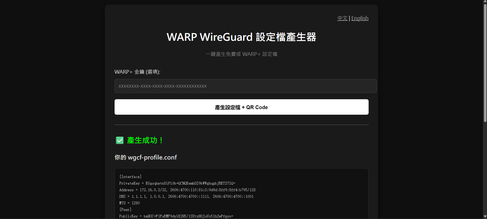

# wgcfweb - WARP WireGuard Config Generator

**極簡黑白風格 + 中英雙語** 的 WARP 設定檔網頁產生器。

5 分鐘就能跑起來，支援輸入 TG 群組的 WARP+ 金鑰，一鍵產生 `.conf` 與 QR Code，適合團隊內部使用。

  
*(實際界面為黑白極簡風格)*

## ✨ 功能特點

- ✅ 支援 **免費 WARP** 與 **WARP+ 金鑰**（TG 群組金鑰）
- ✅ 中英雙語介面，一鍵切換
- ✅ 自動產生 WireGuard `.conf` 與手機掃描 QR Code
- ✅ 每次生成都是全新註冊（免費版無人數限制）
- ✅ 黑白極簡風格，乾淨好看
- ✅ 使用 Flask + wgcf，輕量好部署

## 📸 截圖

（建議上傳實際運行截圖到 repo）

## 🚀 安裝步驟（Ubuntu / LXC）

### 1. 安裝必要工具與 wgcf

```bash
apt update
apt install -y curl wget python3 python3-pip python3-venv git
```

# 下載最新 wgcf
```
curl -L -o /usr/local/bin/wgcf https://github.com/ViRb3/wgcf/releases/latest/download/wgcf_$(curl -s https://api.github.com/repos/ViRb3/wgcf/releases/latest | grep tag_name | cut -d'"' -f4 | sed 's/v//')_linux_amd64
chmod +x /usr/local/bin/wgcf
wgcf --version
```

2. 建立專案目錄與 Web 程式
```Bash
mkdir -p /opt/warp-web
cd /opt/warp-web

# 建立虛擬環境
python3 -m venv venv
source venv/bin/activate
pip install flask qrcode[pil]
```

3. 建立 app.py
```Bash
cat > app.py << 'EOF'
# （把你目前完整的 app.py 內容貼上來）
EOF
```
4. 設定 systemd 服務（推薦背景運行）
```Bash
cat > /etc/systemd/system/warp-web.service << EOF
[Unit]
Description=WARP Web Config Generator
After=network.target

[Service]
WorkingDirectory=/opt/warp-web
ExecStart=/opt/warp-web/venv/bin/python3 /opt/warp-web/app.py
Restart=always
User=root

[Install]
WantedBy=multi-user.target
EOF
```

```
systemctl daemon-reload
systemctl enable --now warp-web
systemctl status warp-web
```


🌐 使用方式
瀏覽器打開 http://你的伺服器IP 即可使用。

金鑰留空 = 生成免費 WARP
貼上 TG 金鑰 = 生成 WARP+（注意同一金鑰最多綁定 5 台裝置）

⚠️ 注意事項

同一把 WARP+ 金鑰最多只能同時綁定 5 台裝置。
伺服器需能連外網（Cloudflare API）。
建議只在內網使用，或加上 Nginx Basic Auth 保護。

📁 專案結構
```
text.
├── app.py
├── venv/
├── requirements.txt
└── /etc/systemd/system/warp-web.service
```


❤️ 感謝

原工具 wgcf
Grok（幫我快速迭代這個專案）


A good shit I took 5min on it and it works. So I put them up.
